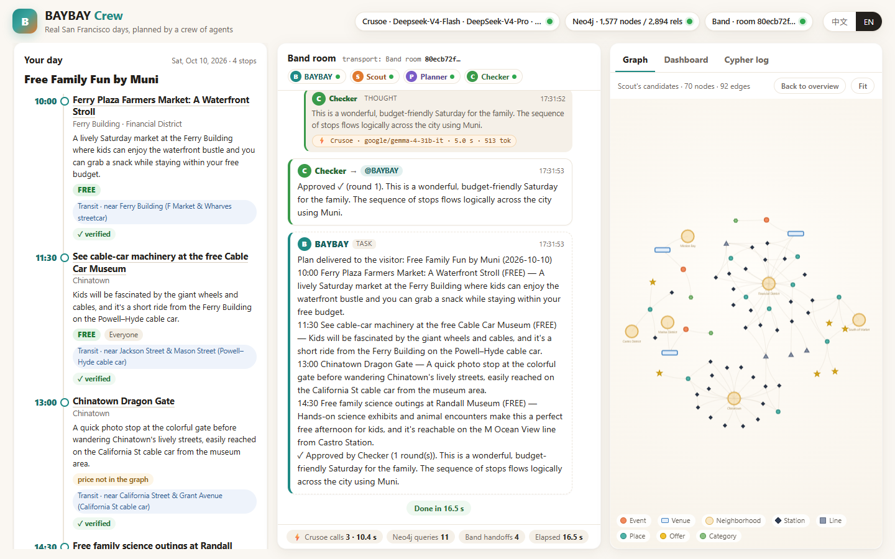
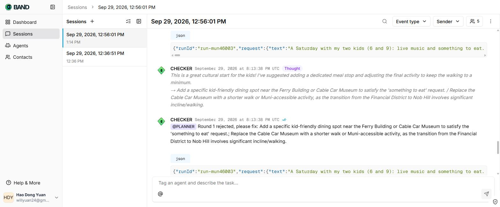
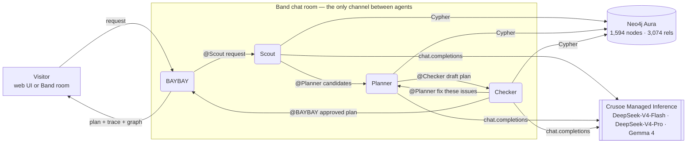

# BAYBAY Crew 🦦 — real San Francisco days, planned by a crew of agents

**Four agents coordinate in a Band room to plan a real day out in San Francisco from a Neo4j knowledge graph of BAYLINK's
verified local catalog, reasoning with open models on Crusoe Managed Inference.**

Ask *"A free Saturday with kids, reachable by Muni"* or *"这周六带小孩，免费、坐公交能到"* → the crew returns a
time-ordered plan where every stop is a real, dated event, free-admission offer or place — each re-checked against the
graph (date, free / paid, age limits) and linked to its BAYLINK page.

Built at HACK 2026 on top of [BAYLINK](https://www.baylink.us) (a bilingual Bay Area events & guides site, existing
project) — **new in this hackathon:** the knowledge graph export + Neo4j model, the four-agent crew, the Band transport,
the Crusoe reasoning layer, the verification loop and this demo UI.

## Demo

▶ **[demo/baybay-crew-walkthrough.mp4](demo/baybay-crew-walkthrough.mp4)** (2:50, narrated, English subtitles; [.srt](demo/baybay-crew-walkthrough.en.srt)): the problem, the stack, a live run, the Band room and the code. Short cut: **[demo/baybay-crew-demo.mp4](demo/baybay-crew-demo.mp4)** (1:46) — a real run: Scout queries Neo4j, Planner drafts, Checker **vetoes** round 1 in the Band room, Planner fixes it, all stops verified.





## Why a crew (and not one chatbot)

A single LLM happily invents events, gets dates wrong and sends families to 21+ shows. The crew splits the job so that
**every fact comes from the graph and every plan is checked before a human sees it**:

| agent | job | tools |
|---|---|---|
| **BAYBAY** (host) | takes the visitor's request (web UI or `@BAYBAY` in the Band room), delivers the verified plan | Band |
| **Scout** | turns the request into filters (Crusoe), runs Cypher on Neo4j: events on that date, free offers, places nearby, transit | Crusoe · Neo4j · Band |
| **Planner** | picks and orders 3–5 stops **only from Scout's candidates**; adds transit via `shortestPath` over the graph | Crusoe · Neo4j · Band |
| **Checker** | re-reads every stop from the graph (date, free, minAge, validity) + a second open model reviews pace / fit; wrong → back to Planner (max 2 rounds) | Neo4j · Crusoe · Band |

## Architecture



- **Band is the coordination layer, not a notification pipe.** Each handoff is a Band message with an `@mention`; the
  JSON payload (request → candidates → draft → issues → verdict) travels *in* the message. Each agent acts only when Band
  delivers it a message (`/agent/chats/{id}/messages/next`, marked processing → processed); thoughts, tool calls and
  results are Band room events. **Delete test:** delete the room and the crew stops — no side channel exists.
- **Neo4j is the memory and the source of truth.** The Scout's and Checker's answers are Cypher results; the plan's
  transit hints are `shortestPath` over `(:Station)-[:NEXT]->(:Station)`; the UI draws the plan's subgraph.
- **Crusoe runs every LLM step** on open-weight models (OpenAI-compatible API), one model per agent: Scout on
  DeepSeek-V4-Flash (filters in ~0.7 s), Planner on DeepSeek-V4-Pro, Checker on Gemma 4 31B — a *different* model reviews
  the plan (cross-model veto). Every call shows provider, model and latency in the UI.

### The graph (exported from BAYLINK)

```
(:Event)-[:AT]->(:Venue)-[:IN]->(:Neighborhood)-[:IN_CITY]->(:City)
(:Venue|:Place|:Offer)-[:NEAR {meters}]->(:Station)-[:ON_LINE {order}]->(:Line)
(:Station)-[:NEXT {line}]->(:Station)      (:Event)-[:OF_CATEGORY]->(:Category)
(:Offer)-[:AT]->(:Place)                   (:Opening)-[:IN_CITY]->(:City)
```

267 Bay Area events (dates, cost, minimum age, official links, verified 2026-09-29), 18 OSM-checked San Francisco venues,
957 places and 72 neighbourhoods (OpenStreetMap), 161 stations on 7 lines (cable cars, F-line, Muni N / M, the
sightseeing loop), 13 verified free / reduced-admission offers, 31 new openings.

Three graph questions power the dashboard tab: free events by neighbourhood, transit hubs with the most attractions
within 700 m, family-friendly events reachable on each line.

## Run it

```bash
npm install
cp .env.example .env        # Crusoe key, Neo4j Aura credentials, four Band agents (see the file)
npm run check               # one line per sponsor: key present, service answering
npm run load                # load data/graph.json into Neo4j Aura (idempotent)
npm start                   # http://localhost:8787
```

Without keys everything still runs (a local in-memory copy of the graph, an in-process room, rule-based reasoning) and the
UI says so — nothing is ever presented as Crusoe / Neo4j / Band when it is not.

Re-export the graph from a BAYLINK checkout: `node node_modules/tsx/dist/cli.mjs scripts/export-from-baylink.mts` (run in
the BAYLINK repo).

## Files

`src/agents.mjs` the crew · `src/room.mjs` Band transport (and the local fallback) · `src/graph.mjs` Cypher tools,
subgraph, dashboard · `src/llm.mjs` Crusoe client · `src/load-neo4j.mjs` loader · `src/check.mjs` sponsor checks ·
`src/server.mjs` HTTP + SSE · `public/index.html` the UI · `data/graph.json` the exported graph.

Data © BAYLINK (catalog) and OpenStreetMap contributors (ODbL) for places, venues and transit.
