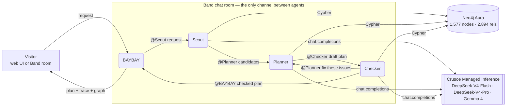

# BAYBAY Crew 🦦 — real San Francisco days, planned by a crew of agents

🏆 **Winner — Best Use of Band** and 🏆 **Winner — Best Use of Neo4j**, The AI Conference Hack Day 2026 (San Francisco,
2026-09-29). Project page on HackerSquad:
https://hackersquad.io/events/the-ai-conference-hack-day-2026/projects/cmun4peby00xmmw23i9kaxpun

**Four agents coordinate in a Band room to plan a real day out in San Francisco from a Neo4j knowledge graph of BAYLINK's
local catalog, reasoning with open models on Crusoe Managed Inference.**

Ask *"A free Saturday with kids, reachable by Muni"* or *"这周六带小孩，免费、坐公交能到"* → the crew returns a
time-ordered plan of 3–5 stops. Every stop is a dated event, a free / reduced-admission offer or a place from the graph,
re-read from the graph by a Checker agent; events and offers link to their BAYLINK pages (places to a BAYLINK guide when
there is one).

Built at The AI Conference Hack Day 2026 on top of [BAYLINK](https://www.baylink.us), a bilingual Bay Area events & guides
site (an existing project). **New at the hackathon:** the knowledge-graph export and Neo4j model, the four-agent crew, the
Band transport, the Crusoe reasoning layer, the verification loop and this demo UI. The full project handoff
(architecture, APIs, known gaps) is [docs/HANDOFF.md](docs/HANDOFF.md).

The judged version is tagged `hackday-2026-submission` (commit 7c842e7); later commits are fixes and docs.

## Demo

▶ **[demo/baybay-crew-walkthrough.mp4](demo/baybay-crew-walkthrough.mp4)** (2:50, 8.4 MB, English subtitles;
[.srt](demo/baybay-crew-walkthrough.en.srt)): the problem, the stack, a live run, the Band room and the code.
Short cut: **[demo/baybay-crew-demo.mp4](demo/baybay-crew-demo.mp4)** (1:46, 5.6 MB): one real run — Scout queries Neo4j, Planner
drafts, Checker **vetoes** round 1 in the Band room, Planner fixes it, Checker approves.

GitHub does not play files this size in the page: use "View raw" to download and play them. Both videos have an AI
voice-over. They were recorded on 2026-09-29 with the judged version. Since then the made-up
"SF Sightseeing Loop" line (a route from BAYLINK's 3D city game, not a real line) was removed from the graph and the
Checker's final-round wording was fixed, so a few frames differ from what the code shows today (the graph counts, one
transit tag, the Checker's last message, some UI labels).

The screenshot is a live run of the current code (2026-10-05, Crusoe, Neo4j Aura and Band all connected); the Band
room picture below it is from the judged run on 2026-09-29, where the Checker vetoes round 1.


## Why a crew (and not one chatbot)

A single LLM happily invents events, gets dates wrong and sends families to 21+ shows. The crew splits the job so that
**every fact comes from the graph and every plan is checked before a human sees it**:

| agent | job | tools |
|---|---|---|
| **BAYBAY** (host) | takes the visitor's request (web UI, or `@BAYBAY …` in the Band room), delivers the checked plan (to the UI, and as a readable summary in the room) | Band |
| **Scout** | turns the request into filters (Crusoe), runs Cypher: events on that date, offers valid that day, places the request names (e.g. Golden Gate Park) and places in the same neighbourhoods, each with its nearest station | Crusoe · Neo4j · Band |
| **Planner** | picks and orders 3–5 stops **only from Scout's candidates**; between two consecutive stops it asks the graph for a `shortestPath` transit hint | Crusoe · Neo4j · Band |
| **Checker** | re-reads every stop from the graph, then a second open model reviews pace and fit; issues → back to Planner (up to 3 drafts, at most 2 vetoes) | Neo4j · Crusoe · Band |

**What the Checker checks** (the graph checks decide; the review model never overrides them):

- events: on that date, in San Francisco, not 18+ when kids come, free when the visitor asked for free, and the stop's
  time against the event's hours when its date label gives one time or one span;
- offers: valid on that date (from / to) and on that weekday, free when asked for free, the stop's time inside the free
  hours when the offer's terms name them (the Japanese Tea Garden's 09:00–10:00), and not an offer "with a child" when
  no kids come;
- places: still in the graph (the graph has no prices for places, so on a free-only day they are tagged "price not in the
  graph");
- the plan: at least 2 stops, no duplicates, readable times in order.

A stop shows "✓ verified" only when every check of that stop passed (a repeated stop, or one outside its hours, does not).

It does **not** check opening hours of places (or of offers beyond the free hours their terms name), whether you hold
an offer's residency or benefits card, travel or walking time, events with several times in their label,
or the free-text tips. The review model (a different model from the Planner's) may send the first draft back for pace or
fit. If graph issues remain after the third draft, the plan is delivered marked not approved, with the open issues
listed; an approved plan lists what was caught and fixed along the way.

## Architecture



- **Band is the coordination layer, not a notification pipe.** Each handoff is a Band message with an `@mention`; the
  JSON payload (request → candidates → draft → issues → verdict) travels *in* the message. Each agent acts only when Band
  delivers it a message (`/agent/chats/{id}/messages/next`, marked processing → processed), and only when the sender is
  the agent whose step comes before its own (for the Planner: Scout, or the Checker with a veto); thoughts, tool calls and results are Band room events. **Delete test:** delete the
  room and the crew stops — no side channel exists.
- **Neo4j is the memory and the source of truth.** Scout's candidates and the Checker's re-reads are Cypher results. A
  transit hint is a `shortestPath` over `(:Station)-[:NEXT]->(:Station)`. `NEXT` links the stops of one line (the two
  Powell cable cars share track, as do N and M) and there are no transfers between lines, so a hint ("5 stops from A to
  B") appears only when every station on the way is on one line; when the path would change lines (even on shared
  track), the plan names the nearest station instead. The graph tab draws the subgraph of Scout's
  candidates; the dashboard tab runs three Cypher queries.
- **Crusoe runs every LLM step** on open-weight models (OpenAI-compatible API), one model per agent: Scout on
  DeepSeek-V4-Flash, Planner on DeepSeek-V4-Pro, Checker on Gemma 4 31B — a *different* model reviews the plan
  (cross-model veto). Every call shows provider, model and latency in the UI.

### The graph (exported from BAYLINK)

```
(:Event)-[:AT]->(:Venue)-[:IN]->(:Neighborhood)-[:IN_CITY]->(:City)
(:Venue|:Place|:Offer)-[:NEAR {meters}]->(:Station)-[:ON_LINE {order}]->(:Line)
(:Station)-[:NEXT {line}]->(:Station)      (:Event)-[:OF_CATEGORY]->(:Category)
(:Offer)-[:AT]->(:Place)                   (:Opening)-[:IN_CITY]->(:City)
```

A snapshot of BAYLINK's catalog of **2026-09-29**: 267 Bay Area events (dates, cost, minimum age, official links; 59 in
San Francisco, the city the crew plans for), 18 OSM-checked San Francisco venues, 957 places and 72 neighbourhoods
(OpenStreetMap), 145 stations on 6 lines (the Powell–Hyde, Powell–Mason and California cable cars, the F Market & Wharves
streetcar, Muni N Judah and M Ocean View; no buses), 13 free / reduced-admission offers, 31 new openings.

| | count |
|---|---|
| nodes (1,577) | Place 957 · Event 267 · Station 145 · Neighborhood 72 · City 64 · Opening 31 · Venue 18 · Offer 13 · Line 6 · Category 4 |
| relationship rows in `data/graph.json` (2,915) | IN 1,081 · NEAR 819 · IN_CITY 370 · OF_CATEGORY 267 · ON_LINE 168 · NEXT 155 · AT 49 · IS_PLACE 6 |
| relationships in Neo4j after `MERGE` (2,894) | 21 rows repeat a pair already linked by the same type (14 NEXT rows on track two lines share, 7 ON_LINE rows where the F line lists a stop twice in a row), and `MERGE` keeps one: ON_LINE 161 · NEXT 141, the rest as above |

**The events end on 2026-10-31.** San Francisco events run from 2026-09-26 to 2026-10-31 (3–6 per Saturday). For a later
date the graph has no events: the UI and the Scout say so, and the plan uses offers and places only until the graph is
re-exported.

Three graph questions power the dashboard tab: free events by neighbourhood, transit hubs with the most attractions
within 700 m, family-friendly events reachable on each line.

## Run it

Requires Node 22 or later. Try it without any keys:

```bash
git clone https://github.com/willyuan24-source/baybay-crew && cd baybay-crew
npm install
npm start                     # then open http://localhost:8787
```

**Without keys** the crew runs end to end on a local in-memory copy of the graph, an in-process room and rule-based
reasoning, and the labels say so (the status pills, "rule-based steps" under the trace, "local graph" on every query in
the Cypher log).

**With keys** (see [.env.example](.env.example)): a Crusoe API key; a Neo4j Aura instance (`npm run load` replaces every
`:Entity` node in it, the label this project gives its nodes); four External agents in Band (BAYBAY, Scout, Planner,
Checker), each one's Agent UUID and API key, and `BAND_ROOM_ID` of a room with all four (and you) to watch the runs. The
host's display name in Band can be anything (in the videos it is `@Baylink`): the code addresses agents by id.

```bash
cp .env.example .env          # PowerShell: Copy-Item .env.example .env — then fill in the keys you have
npm run check                 # one line per service (each agent's Crusoe model, Neo4j, each Band agent, the room)
npm run load                  # load data/graph.json into Neo4j (use a dedicated, empty database)
npm start                     # http://localhost:8787
```

The server listens on **127.0.0.1 only** (`HOST` changes that). It is a local demo, not meant to be deployed as is: there
is no auth and no rate limiting beyond a cap of 3 runs at a time, and with keys every run spends Crusoe credits and posts
into your Band room.

Re-export the graph from a [BAYLINK](https://github.com/willyuan24-source/baylink-web) checkout with its dependencies
installed, using BAYLINK's `tsx` (here the checkout sits next to this repo):

```bash
BAYLINK_DIR=../baylink-web node ../baylink-web/node_modules/tsx/dist/cli.mjs scripts/export-from-baylink.mts
```

It overwrites `data/graph.json` with BAYLINK's catalog as it is that day, so every count above changes; run
`npm run load` afterwards.

## Files

`src/agents.mjs` the crew · `src/room.mjs` Band transport (and the local room) · `src/graph.mjs` Cypher tools, local
engine, subgraph, dashboard · `src/llm.mjs` Crusoe client · `src/config.mjs` env · `src/load-neo4j.mjs` loader ·
`src/check.mjs` service checks · `src/server.mjs` HTTP + SSE · `public/index.html` the UI · `data/graph.json` the
exported graph ([data/README.md](data/README.md)) · `scripts/export-from-baylink.mts` the exporter · `demo/` videos,
screenshots, slides and the recorder · `docs/HANDOFF.md` the full handoff.

## License

The code is under the [MIT License](LICENSE). The data is not: `data/graph.json` holds BAYLINK's event catalog
(© BAYLINK) and data derived from [OpenStreetMap](https://www.openstreetmap.org/copyright) (© OpenStreetMap contributors,
available under the Open Database License 1.0). See [data/README.md](data/README.md).
